# Architecture Diagrams and Gap Visualization

## 1. Current System Architecture

```mermaid
graph TB
    subgraph "External Systems"
        AppyPay[AppyPay/MultiCaixa]
        Odoo[Odoo SaaS]
    end
    
    subgraph "Quarkus Application"
        WebhookResource[AppyPayWebhookResource<br/>POST /webhooks/appypay]
        WebhookProcessor[WebhookProcessor<br/>@Blocking Async]
        PaymentService[PaymentProcessService<br/>handleSuccessfulPayment]
        OdooClient[OdooDocumentClient<br/>XML-RPC]
        TokenService[DocumentAccessTokenService<br/>generateToken]
        DocumentResource[DocumentAccessResource<br/>/api/documents/*]
        
        WebhookEvents[(webhook_events)]
        Orders[(orders)]
        PaymentTx[(payment_transactions)]
        Tokens[(document_access_tokens)]
        Audits[(document_access_audit)]
    end
    
    subgraph "Employer"
        Browser[Employer Browser]
    end
    
    AppyPay -->|1. Payment Webhook| WebhookResource
    WebhookResource -->|2. Queue Event| WebhookProcessor
    WebhookProcessor -->|3. Process Payment| PaymentService
    PaymentService -->|4. Save| Orders
    PaymentService -->|5. Create| PaymentTx
    PaymentService -->|6. Notify| Odoo
    
    PaymentService -.->|❌ MISSING LINK| TokenService
    
    TokenService -->|7. Create Token| Tokens
    
    Browser -->|8. Request Documents| DocumentResource
    DocumentResource -->|9. Validate Token| TokenService
    DocumentResource -->|10. Fetch Documents| OdooClient
    OdooClient -->|11. XML-RPC| Odoo
    Odoo -->|12. Return Documents| OdooClient
    OdooClient -->|13. Return| DocumentResource
    DocumentResource -->|14. Log Access| Audits
    DocumentResource -->|15. Download| Browser
    
    WebhookResource -->|Save| WebhookEvents
    
    style PaymentService fill:#ff9999
    style TokenService fill:#ff9999
    style OdooClient fill:#ffcc99
```

### Legend
- 🔴 **Red**: Components with critical gaps
- 🟠 **Orange**: Components with issues
- ⚫ **Black Lines**: Existing connections
- 🔴 **Red Dashed**: Missing connections

---

## 2. Payment-to-Document Flow (With Gaps Highlighted)

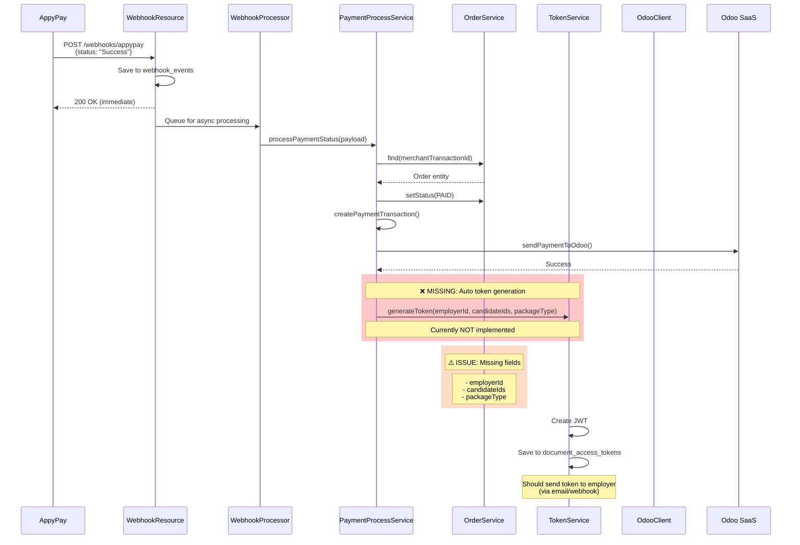

---

## 3. Document Access Flow (Current vs Expected)

### Current Implementation
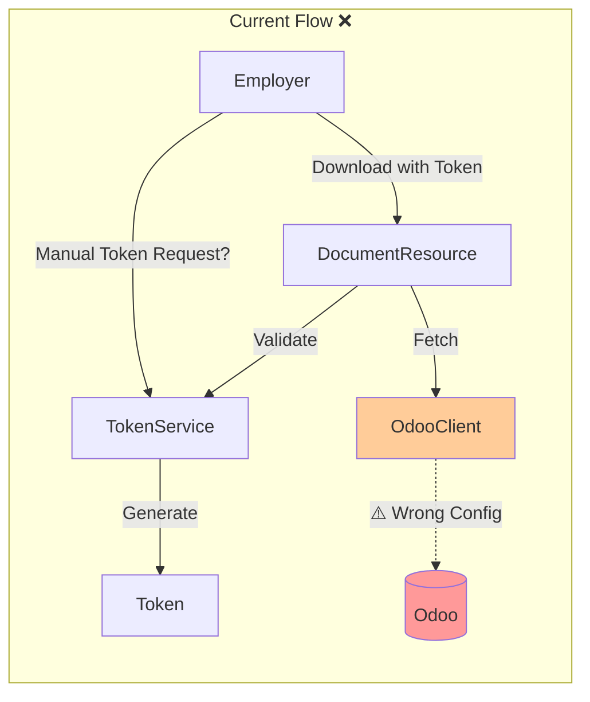

### Expected Implementation
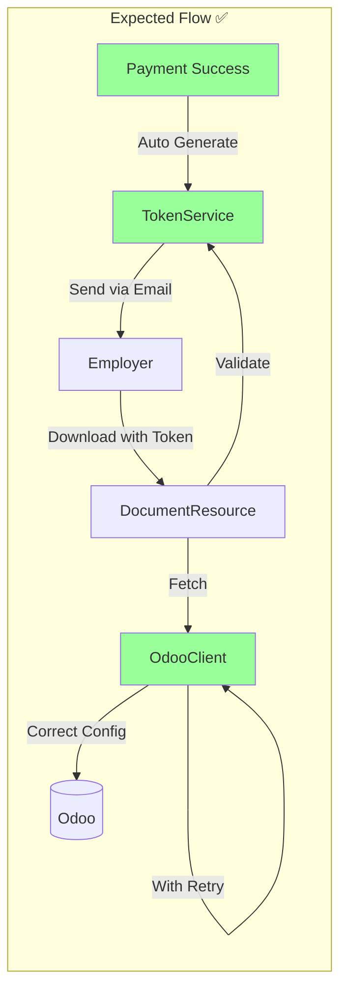

---

## 4. Data Model with Mapping Gaps

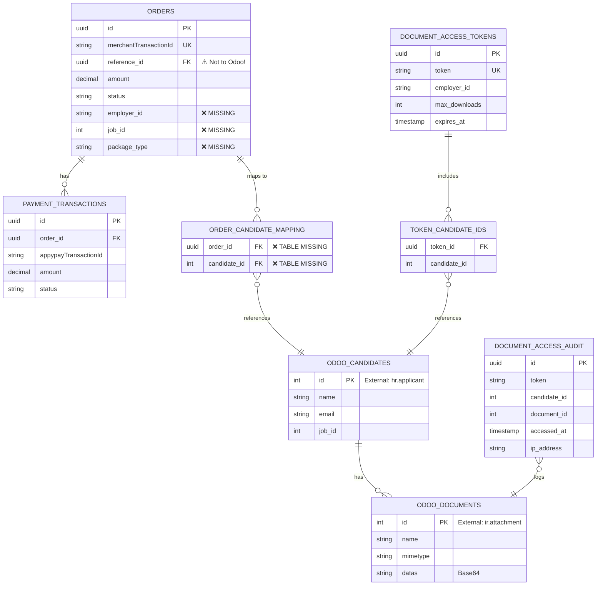

### Legend
- ✅ **Exists**: Implemented correctly
- ⚠️ **Issue**: Exists but has problems
- ❌ **Missing**: Not implemented

---

## 5. Configuration Issues

### Current Configuration (WRONG ❌)
```yaml
# application.yml
quarkus:
  datasource:
    db-kind: postgresql          # ← OdooClient reads this as Odoo DB name! ❌
    username: postgres           # ← Database user, not Odoo user! ❌
    password: postgres           # ← Database password, not Odoo password! ❌
    jdbc:
      url: jdbc:postgresql://localhost:5432/odoo_payments
```

```java
// OdooDocumentClient.java (WRONG)
@ConfigProperty(name = "quarkus.datasource.db-kind")
String database;  // Will be "postgresql", not Odoo database name!

@ConfigProperty(name = "quarkus.datasource.username")
String username;  // Will be "postgres", not Odoo username!
```

### Expected Configuration (CORRECT ✅)
```yaml
# application.yml
odoo:
  url: ${ODOO_URL:http://localhost:8069}
  database: ${ODOO_DATABASE:odoo}      # ← Correct Odoo database
  username: ${ODOO_USERNAME:admin}     # ← Correct Odoo user
  password: ${ODOO_PASSWORD}           # ← Correct Odoo password

jwt:
  secret: ${JWT_SECRET}                # ← Currently missing!
  issuer: document-service
```

```java
// OdooDocumentClient.java (CORRECT)
@ConfigProperty(name = "odoo.url")
String odooUrl;

@ConfigProperty(name = "odoo.database")
String database;

@ConfigProperty(name = "odoo.username")
String username;

@ConfigProperty(name = "odoo.password")
String password;
```

---

## 6. Test Coverage Visualization

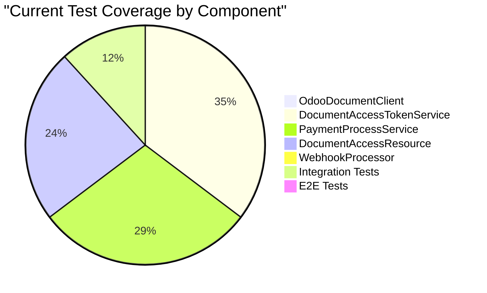

### Target Test Coverage
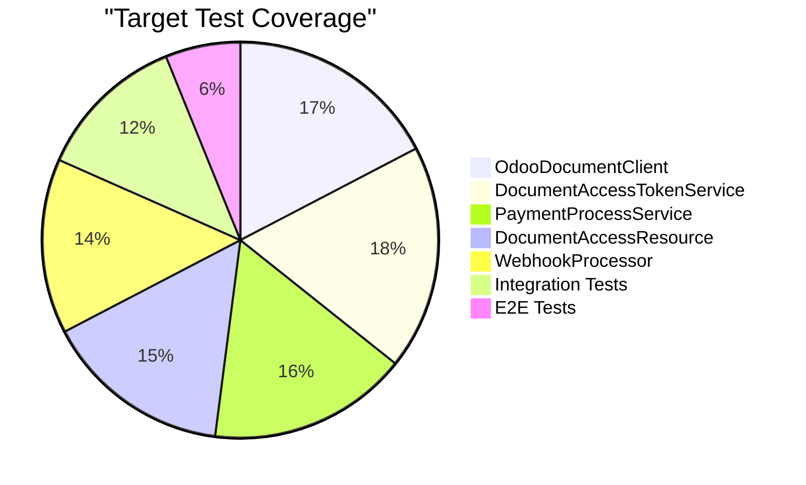

---

## 7. Error Handling Flow (Current vs Expected)

### Current: No Error Recovery ❌
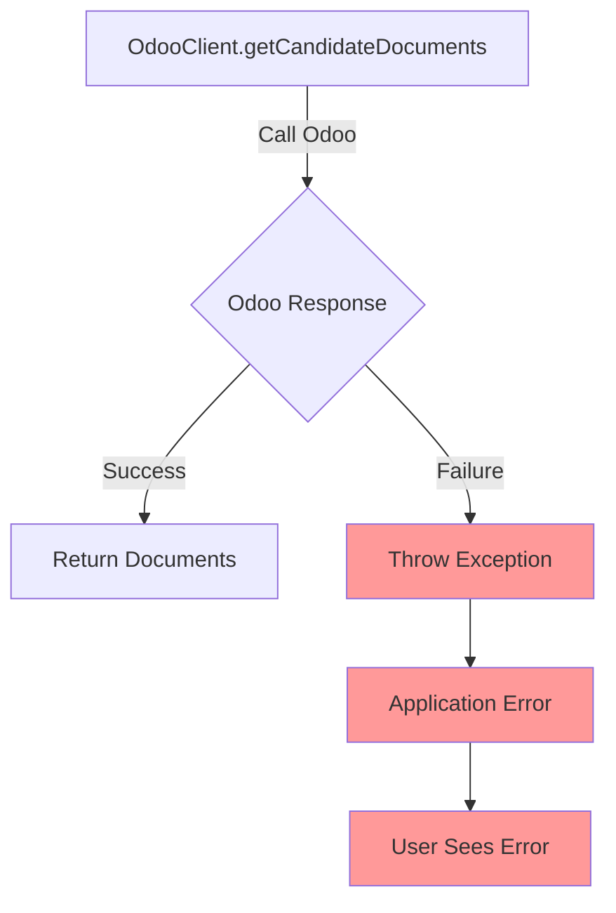

### Expected: With Fault Tolerance ✅
```mermaid
graph TB
    A[OdooClient.getCandidateDocuments<br/>@Retry @Timeout @Fallback] -->|Call 1| B{Odoo Response}
    B -->|Failure| C[Wait 1s]
    C -->|Call 2| D{Odoo Response}
    D -->|Failure| E[Wait 1.5s]
    E -->|Call 3| F{Odoo Response}
    F -->|Failure| G[Invoke Fallback]
    G --> H[Return Empty List + Log Error]
    H --> I[User Sees Graceful Message]
    
    B -->|Success| J[Return Documents]
    D -->|Success| J
    F -->|Success| J
    
    A -->|Timeout > 10s| K[Cancel Request]
    K --> G
    
    style G fill:#99ff99
    style H fill:#99ff99
    style I fill:#99ff99
    style J fill:#99ff99
```

---

## 8. Integration Points Summary

| Integration | Protocol | Status | Issues |
|-------------|----------|--------|--------|
| **AppyPay → Backend** | REST Webhook | ✅ Working | None |
| **Backend → Odoo (Payment)** | REST | ✅ Working | Uses `OdooApiClient` correctly |
| **Backend → Odoo (Documents)** | XML-RPC | ❌ Broken | Wrong credentials configuration |
| **Employer → Backend (Tokens)** | N/A | ❌ Missing | No auto-generation |
| **Employer → Backend (Download)** | REST | ⚠️ Partial | Works if token exists, but tokens not created |

---

## 9. Critical Path Analysis

### Happy Path (Should Work)
```mermaid
graph LR
    A[Payment Success] -->|1| B[Webhook Received]
    B -->|2| C[Order Created]
    C -->|3| D[Transaction Saved]
    D -->|4| E[Odoo Notified]
    E -->|❌ 5. MISSING| F[Token Generated]
    F -->|6| G[Employer Notified]
    G -->|7| H[Employer Downloads]
    
    style A fill:#99ff99
    style B fill:#99ff99
    style C fill:#99ff99
    style D fill:#99ff99
    style E fill:#99ff99
    style F fill:#ff9999
    style G fill:#ff9999
    style H fill:#ff9999
```

### Current Reality (Broken)
```mermaid
graph LR
    A[Payment Success] -->|✅| B[Webhook Received]
    B -->|✅| C[Order Created]
    C -->|✅| D[Transaction Saved]
    D -->|⚠️| E[Odoo Notified<br/>May Fail]
    E -.->|❌| X[STOPS HERE]
    X -.->|Manual?| F[Token Generated]
    F -->|✅| G[Employer Downloads]
    G -.->|❌| H[Odoo Fetch Fails<br/>Wrong Config]
    
    style A fill:#99ff99
    style B fill:#99ff99
    style C fill:#99ff99
    style D fill:#99ff99
    style E fill:#ffcc99
    style X fill:#ff0000
    style F fill:#ff9999
    style H fill:#ff0000
```

---

## 10. Implementation Priority Heat Map

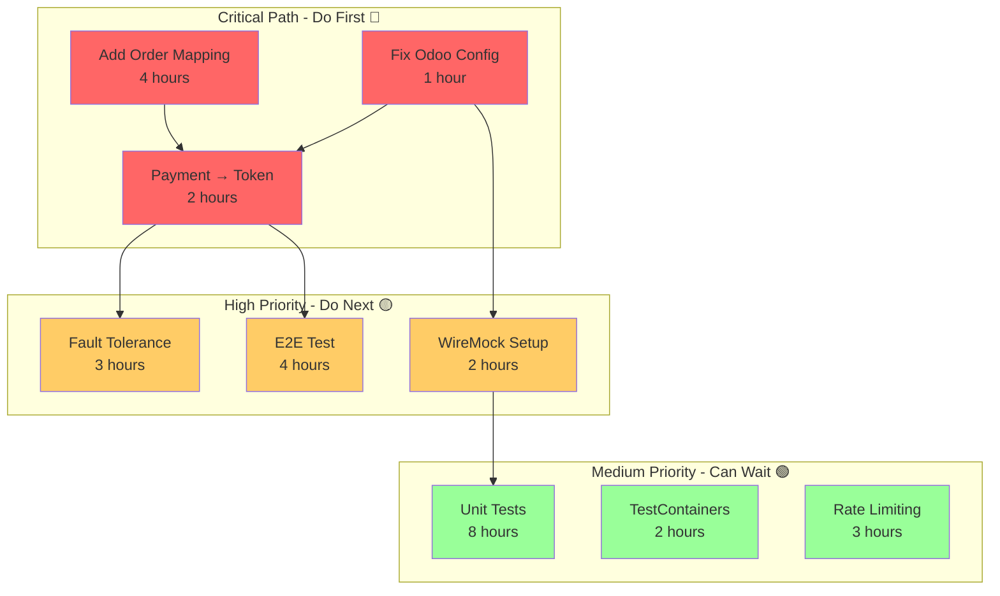

---

## 11. Risk Heat Map

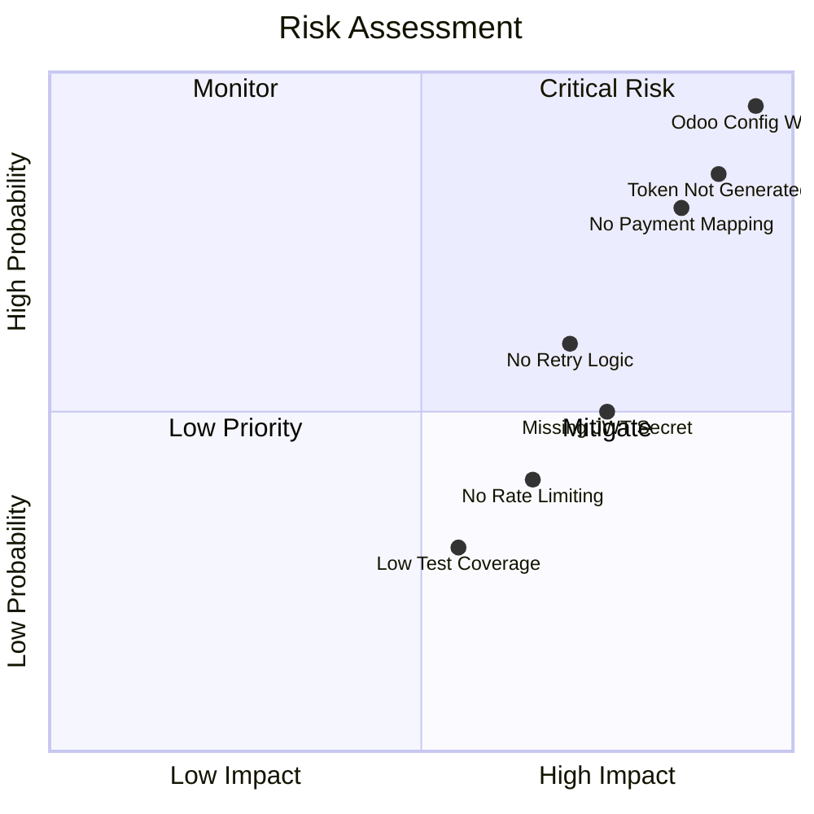

### Risk Legend
- **Quadrant 1 (Top Right)**: Critical - Fix immediately
- **Quadrant 2 (Top Left)**: Monitor closely
- **Quadrant 3 (Bottom Left)**: Low priority
- **Quadrant 4 (Bottom Right)**: Mitigate soon

---

## 12. System State Diagram

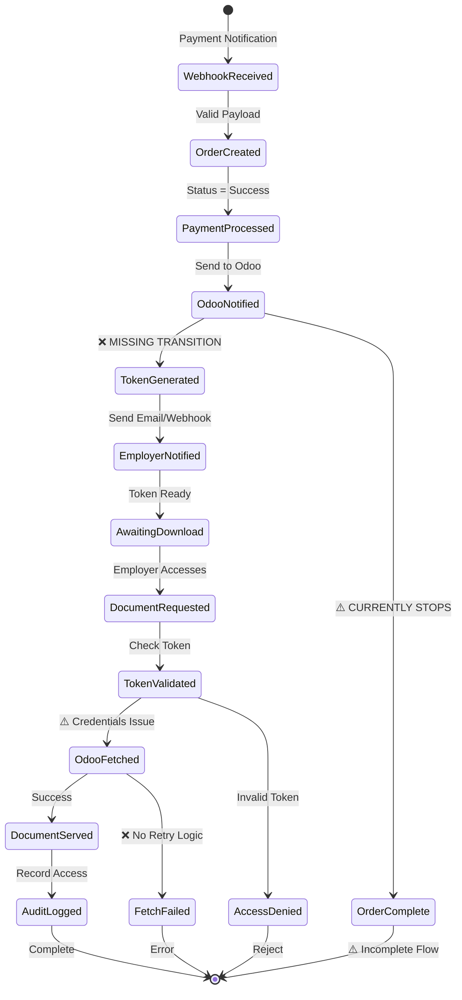

---

## Summary of Architectural Gaps

### 🔴 **Critical Gaps**
1. ❌ Odoo authentication uses wrong credentials
2. ❌ No payment-to-token auto-generation
3. ❌ Missing payment-document mapping

### 🟡 **Important Issues**
4. ⚠️ No error recovery for Odoo failures
5. ⚠️ Missing JWT secret configuration
6. ⚠️ No integration/E2E tests

### 🟢 **Nice to Have**
7. ⚠️ No rate limiting
8. ⚠️ Low unit test coverage
9. ⚠️ No monitoring/alerting

---

**Document Version**: 1.0  
**Last Updated**: 2026-02-16  
**Next Review**: After implementing critical tasks
